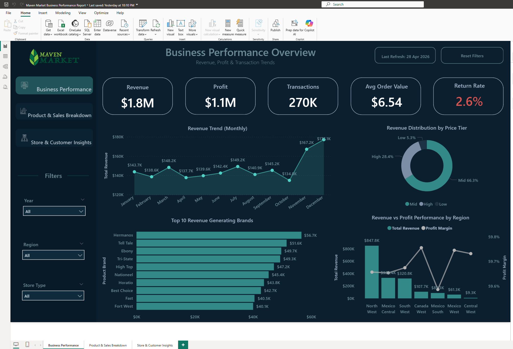
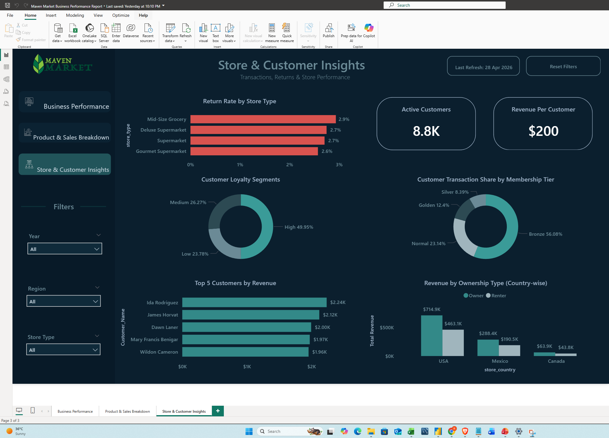

# maven-market-business-performance-report
Power BI dashboard analyzing business performance, product sales, customer behavior, and store insights using Maven Market dataset.

# Maven Market Business Dashboard (Power BI)

##  Overview
This project is a Power BI dashboard built using the Maven Market dataset.  
It focuses on analyzing overall business performance, product sales, customer behavior, and store insights.

---

##  Key Areas Covered
- Business Performance Overview (Revenue, Profit, Trends)
- Product & Sales Breakdown
- Customer & Store Insights

---

##  Key Observations
- A few products contribute most of the overall sales
- High return rate products are different from top-selling products
- Customer behavior varies across store types
- Revenue performance is steady across regions

---

##  Challenges Faced
- Avoiding too many repetitive visuals
- Handling missing transaction-level data (no transaction ID)
- Balancing clean design with meaningful insights

---

##  Tools Used
- Power BI
- DAX
- Data Modeling

---

## Dashboard Preview

### Business Performance Overview

### Product & Sales Breakdown

### Store & Customer Insights

