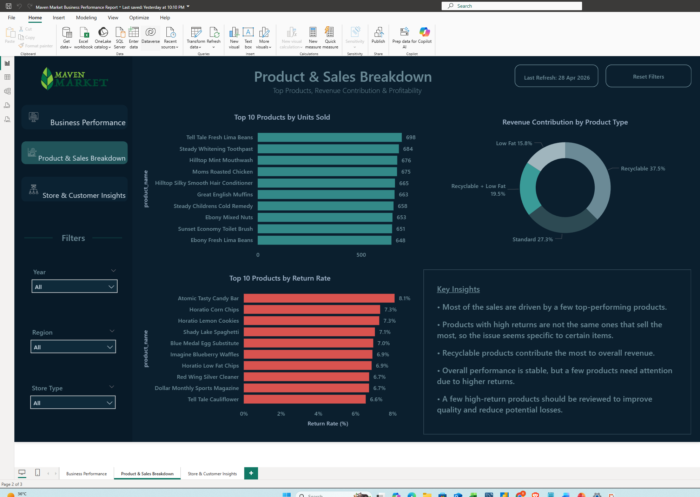

# maven-market-business-performance-report
Power BI dashboard analyzing business performance, product sales, customer behavior, and store insights using Maven Market dataset.

# Maven Market Business Dashboard (Power BI)

##  Overview
This dashboard was built as part of my portfolio to analyze retail business performance using Power BI.
It focuses on analyzing overall business performance, product sales, customer behavior, and store insights.

---

##  Key Areas Covered
- Business Performance Overview (Revenue, Profit, Trends)
- Product & Sales Breakdown
- Customer & Store Insights

---

##  Key Observations

- Most of the sales are coming from a small group of products
- High return rate products are different from the top-selling ones
- This suggests returns are related to specific products, not overall sales volume
- Recyclable category is contributing the highest share of revenue
- A few products need attention due to consistently higher return rates

---

##  Challenges Faced
- Avoiding too many repetitive visuals
- Handling missing transaction-level data (no transaction ID)
- Balancing clean design with meaningful insights

---

##  Tools Used
- Power BI
- DAX
- Data Modeling

---

## Dashboard Preview

